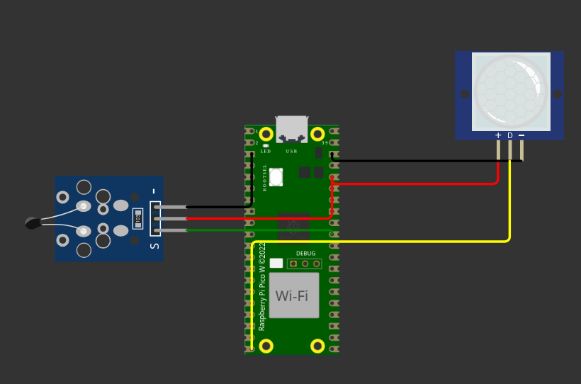

# Firmware Embarcado — Raspberry Pi Pico W com Sensores NTC e PIR

> **Atividade Ponderada 3** — Integração com Raspberry Pi Pico W  

## Visão Geral

Este repositório contém o firmware desenvolvido para a atividade ponderada que integra um Raspberry Pi Pico W com sensores analógico (NTC de temperatura) e digital (PIR de presença), enviando telemetria ao backend desenvolvido na [atividade anterior](https://github.com/SophiSenne/arquitetura-fila).

O dispositivo realiza leituras periódicas dos sensores, aplica tratamento de sinal (suavização por média móvel e debouncing), e transmite os dados formatados via HTTP POST ao endpoint do backend, com suporte a reconexão Wi-Fi e retry com backoff exponencial.

## Framework e Toolchain

| Item | Valor |
|---|---|
| **Framework** | Arduino Framework |
| **Plataforma** | Raspberry Pi Pico W (RP2040 + CYW43439) |
| **Simulador** | [Wokwi](https://wokwi.com/) |
| **Linguagem** | C++ (Arduino) |
| **Bibliotecas** | `WiFi.h`, `HTTPClient.h`, `ArduinoJson`, `time.h` |
| **IDE / Build** | Arduino IDE ou PlatformIO |

## Sensores Integrados

### Sensor de Temperatura — NTC (Analógico)

* **Pino GPIO**: `GP26` (ADC0 / `A0`)
* **Alimentação**:  3,3 V 
* **Range de valores esperados**:  −24 °C a 85 °C 
* **Técnica de suavização**:  Média móvel — janela de 8 amostras 

**Fórmula de conversão aplicada:**

```
temperatura (°C) = −0,125 × raw_ADC + 88,5
```
A fórmula foi derivada a partir dos valores de referência observados no simulador Wokwi para o sensor NTC, usando dois pontos de calibração:
 
| Ponto | raw ADC | Temperatura |
|---|---|---|
| Mínimo | 115 | -24 °C |
| Máximo | 953 | 80 °C |
 
Com esses dois pontos, aplica-se uma interpolação linear para obter os coeficientes da equação. Amostras fora do range válido (−24 °C a 85 °C) são descartadas e o último valor médio calculado é retornado no lugar.

### Sensor de Presença — PIR (Digital)

* **Pino GPIO**:  `GP15` 
* **Alimentação**:  3,3 V 
* **Saída**:  `1` (presença detectada) / `0` (sem presença) 
* **Debouncing**:  50 ms por software 

## Formato de Telemetria

Cada leitura é enviada via **HTTP POST** ao endpoint `/sensorData` no seguinte formato JSON:

```json
{
  "idSensor": "SN-TH-001",
  "timestamp": "2025-06-01T14:32:00Z-03:00",
  "sensorType": "temperatura",
  "readType": "analog",
  "value": 24.5
}
```

```json
{
  "idSensor": "SN-PIR-001",
  "timestamp": "2025-06-01T14:32:01Z-03:00",
  "sensorType": "presença",
  "readType": "discrete",
  "value": 1
}
```

O timestamp é obtido via **NTP** (`pool.ntp.org`) com offset de `−03:00` (horário de Brasília).

## Mecanismo de Retry

Em caso de falha de transmissão HTTP, o firmware aplica retry com backoff exponencial:

| Parâmetro | Valor |
|---|---|
| Tentativas máximas | 4 |
| Delay base | 500 ms |
| Delay máximo | 16.000 ms |
| Jitter aleatório | 0–200 ms |

Códigos HTTP que disparam retry: erros de rede (`≤ 0`), `429 Too Many Requests` e qualquer `5xx`.

## Conexões

<div align="center">
<sup>Figura 1 - Diagrama de conexões</sup>
<br>



<sup>Print da tela do Wokwi</sup>
</div>


| Sinal | Pico W | Sensor |
|---|---|---|
| VCC Temperatura | 3V3 | NTC VCC |
| GND Temperatura | GND | NTC GND |
| Saída Temperatura | GP26 (A0) | NTC OUT |
| VCC Presença | 3V3 | PIR VCC |
| GND Presença | GND | PIR GND |
| Saída Presença | GP15 | PIR OUT |
| Serial Monitor TX | GP0 | $serialMonitor RX |
| Serial Monitor RX | GP1 | $serialMonitor TX |

## Configuração de Rede e Backend

As configurações de rede e endpoint estão definidas no arquivo `wokwi-simulation/config.h`, o qual foi colocado no `.gitignore`. É necessário criá-lo manualmente antes de compilar ou simular.

```cpp
const char* SSID     = "";   // Nome da rede Wi-Fi
const char* PASSWORD = "";               // Senha da rede
const char* API_URL  = "http://<seu-endpoint>/sensorData";  // URL do backend
```

1. Substitua `SSID` e `PASSWORD` pelas credenciais da rede.
2. Execute o backend da Atividade Anterior conforme as instruções do [repositório](https://github.com/SophiSenne/arquitetura-fila).
3. Com a aplicação rodando localmente, utilize o **[ngrok](https://ngrok.com/)** para expô-la publicamente:
   ```bash
   ngrok http <porta-do-backend>
   ```
4. Copie a URL gerada pelo ngrok (ex: `https://xxxx-xx-xx-xxx-xx.ngrok-free.app`) e defina como `API_URL`:
   ```cpp
   const char* API_URL = "https://xxxx-xx-xx-xxx-xx.ngrok-free.app/sensorData";
   ```
5. Ajuste `gmtOffset_sec` se necessário (atualmente configurado para `UTC−3`).

## Instruções de Compilação e Gravação — Arduino IDE

1. Instale o [Arduino IDE](https://www.arduino.cc/en/software).
2. Adicione o suporte à placa Pico W em **Preferências → URLs adicionais**:
   ```
   https://github.com/earlephilhower/arduino-pico/releases/download/global/package_rp2040_index.json
   ```
3. Instale a placa **Raspberry Pi Pico/RP2040** via **Gerenciador de Placas**.
4. Instale as bibliotecas necessárias via **Gerenciador de Bibliotecas**:
   - `ArduinoJson` (by Benoit Blanchon)
5. Selecione a placa: **Tools → Board → Raspberry Pi Pico W**.
6. Abra `wokwi-simulation/sketch.ino` e clique em **Upload**.

## Simulação com Wokwi

Este projeto foi desenvolvido utilizando o simulador **[Wokwi](https://wokwi.com/)**, que emula o Raspberry Pi Pico W com os sensores NTC e PIR.

**Como executar a simulação:**

1. Acesse [wokwi.com](https://wokwi.com/) e crie um novo projeto para **Raspberry Pi Pico W**.
2. Copie o conteúdo do arquivo `wokwi-simulation/diagram.json` para a aba de diagrama do Wokwi.
3. Copie o conteúdo de `wokwi-simulation/sketch.ino` para o editor de código.
4. Crie um novo arquivo chamado `config.h` no projeto do Wokwi e preencha com as credenciais:
   ```cpp
   #ifndef CONFIG_H
   #define CONFIG_H
 
   const char* SSID     = "Wokwi-GUEST";
   const char* PASSWORD = "";
   const char* API_URL  = "http://<seu-endpoint>/sensorData";
 
   #endif
   ```
5. Clique em **Play** para iniciar a simulação.
6. Observe o **Serial Monitor** para acompanhar as leituras e os envios HTTP.

## Evidências de Funcionamento

🎥 [Assista à demonstração](https://docs.google.com/videos/d/1D0hbsCV3fcAFOMVK6ALaa99fmzmblRCQTKZVTQeR2Og/edit?usp=sharing)

## Referência ao Backend — Atividade Anterior

Este firmware é compatível com o backend desenvolvido na Atividade Ponderada 2.  
Repositório da Atividade: https://github.com/SophiSenne/arquitetura-fila

O endpoint utilizado é:
```
POST /sensorData
Content-Type: application/json
```

---

## Estrutura do Repositório

```
├── wokwi-simulation/
│   ├── config.h          # Não versionado — criar manualmente (ver seção de Configuração)
│   ├── diagram.json      # Esquemático de conexão dos sensores NTC e PIR ao Pico W
│   ├── libraries.txt     # Dependências do projeto (ArduinoJson)
│   ├── sketch.ino        # Firmware principal — leitura de sensores, Wi-Fi, HTTP e retry
│   └── wokwi-project.txt # Metadados do projeto Wokwi (ID e versão do simulador)
└── README.md             # Documentação do projeto
```
